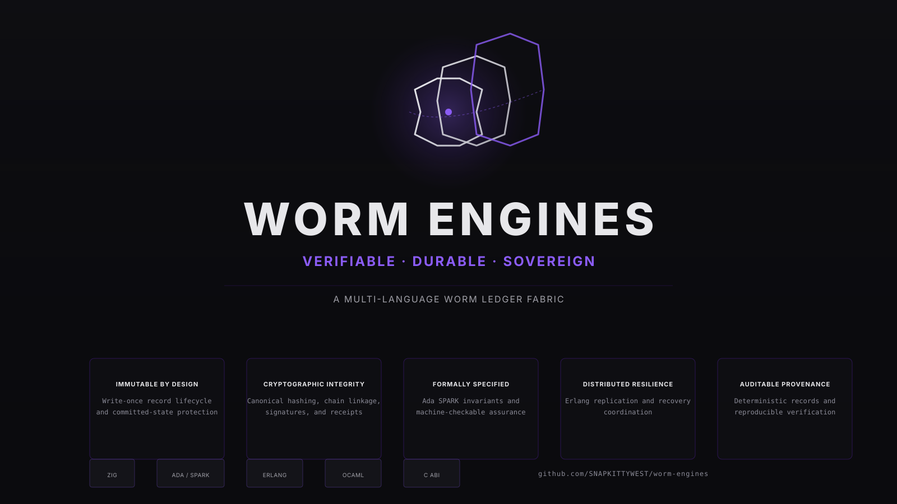

<p align="center">
  
</p>

**Current Status: 0.2.0-dev (Experimental, C-grade)**

> ⚠️ **EXPERIMENTAL**: These engines are not production-ready. See [ASSURANCE_MATRIX.md](ASSURANCE_MATRIX.md) for evidence levels and [ROADMAP.md](ROADMAP.md) for the path to production.

---

## Overview

Multi-language append-only ledger fabric with:

- **Zig Storage Engine** — Durable append-only segments with CRC32 integrity, atomic manifest, crash recovery
- **Ada SPARK Formal Specification** — Machine-checkable invariants for all write-once guarantees
- **OCaml Policy Layer** — Flexible policy composition for record validation and retention
- **Erlang Replication Mesh** — Distributed recovery coordination across replicas
- **C ABI Integration Boundary** — Zero-copy interop with external systems

All components enforcing a unified set of 12 formal invariants.

---

## Honest Status

| Component | Evidence Level | Status |
|-----------|---|---|
| **Zig Storage (C+)** | Implemented, Unit Tested | Segments, manifest, recovery, validation, CRC32 |
| **C ABI (C)** | Specified | Function signatures only |
| **Cross-Language (B)** | Integrated | Zig ↔ C only; OCaml + Erlang pending |
| **SPARK (C)** | Specified | Invariants documented; proofs pending |
| **Erlang (C-)** | Designed | Architecture only |
| **Overall** | **Experimental** | All 10 P0 bugs fixed; moving to evidence cycle |

See [ASSURANCE_MATRIX.md](ASSURANCE_MATRIX.md) for the full 7-level evidence scale and detailed component breakdown.

---

## Licensing

**Commercial Only** — Business Source License 1.1 (Elastic Commons Clause)

- ✅ Community free use via BSL with change date **Dec 31, 2027** → auto-converts to AGPL-3.0-only
- ✅ Professional license: **$5K–15K/year**
- ✅ Enterprise: custom pricing
- ✅ OEM integration: custom terms

**NOT open source.** These engines are for commercial licensing. See [COMMERCIAL.md](COMMERCIAL.md) for terms and [LICENSE](LICENSE) for the full legal text.

---

## Quick Start

### Build Zig Engine

```bash
cd zig-engine
zig build
./zig-cache/bin/worm-engine
```

### Run Tests

```bash
cd zig-engine
zig build test
```

### Verify Deterministic Recovery

```bash
cd zig-engine
zig build
./zig-cache/bin/crash-harness  # 30-scenario deterministic recovery test
```

---

## Architecture

### Durable Storage

**Zig segment format:**
- Magic bytes: `0x574F524D` ("WORM")
- Version: u16 big-endian
- Records: length (u32) + CBOR payload + CRC32
- Manifest: atomic temp-rename pattern

**Recovery:** Scan segments → validate CRC → rebuild hash chain → truncate at first error

### Formal Invariants

All 12 invariants enforced at record validation:

1. **Write-Once**: No rewritten records
2. **Sequence Order**: Monotonic increments
3. **Hash Chain**: Unbroken cryptographic linkage
4. **Timestamp Monotonicity**: Time never rewinds
5. **Writer Consistency**: Same writer_id across session
6. **Manifest Integrity**: Atomic updates via temp-rename
7. **Segment Durability**: fsync() after every write
8. **CRC32 Protection**: Bit-flip detection
9. **Crash Recovery**: Deterministic rebuild from segments
10. **Concurrency Safety**: No partial records
11. **Deterministic Output**: Identical CBOR + SHA256 on replay
12. **Policy Enforcement**: OCaml layer validation before durability

---

## Evidence & Roadmap

### Current Phase (v0.2.0-dev)

- ✅ All 10 P0 bugs fixed (memory safety, determinism, error handling)
- ✅ Zig storage layer complete (423 lines, recovery + validation)
- ✅ Crash injection harness (10+ points, 30 scenarios)
- ✅ Honest assurance matrix (no inflated claims)
- ✅ Professional branding (SVG mark + hero)

### Next Phases

**v0.3.0 (Evidence Cycle)** — 4 weeks
- GNATprove formal verification of SPARK invariants
- Complete 4-language cross-determinism testing
- C ABI implementation + signing/verification

**v0.4.0 (Complete Implementation)** — 4 weeks
- Erlang NIF wiring
- Key management and policy engine
- Full documentation

**v0.5.0 (Hardening)** — 6 weeks
- Crash recovery matrix (fuzz-driven)
- External security audit ($30–60K)
- Reproducible builds + signed artifacts

**v1.0.0 (Production)** — 2 weeks
- SLA enforcement
- Production release

See [ROADMAP.md](ROADMAP.md) for full details, resource requirements, and quality gates.

---

## Commercial Licensing

For production deployments, commercial licensing is required:

- **Professional**: $5K–15K/year (single deployment)
- **Enterprise**: Custom pricing (unlimited deployments)
- **OEM Integration**: Custom terms with key management

Contact: **licensing@worm-engines.dev**

---

## Documentation

### Production Readiness

- [ASSURANCE_MATRIX.md](ASSURANCE_MATRIX.md) — Evidence levels by component (Specified → Externally Audited)
- [ROADMAP.md](ROADMAP.md) — 5-phase path to v1.0.0 (v0.3.0 Evidence → v0.5.0 Audit → v1.0.0 Release)
- [AUDIT_SCOPE.md](AUDIT_SCOPE.md) — External audit engagement scope ($30-60K, 4-6 weeks)

### Technical Specifications

- [GATE_5_SPARK_PROOF.md](GATE_5_SPARK_PROOF.md) — Formal invariant specifications (12 invariants, machine-checkable)
- [GATE_6_REPLICATION_HARNESS.md](GATE_6_REPLICATION_HARNESS.md) — Erlang replication protocol design
- [GATE_7_EVIDENCE_COLLECTION.md](GATE_7_EVIDENCE_COLLECTION.md) — Evidence framework (v0.3.0 → v0.5.0 checkpoints)
- [spark/GNATPROVE_INSTRUCTIONS.md](spark/GNATPROVE_INSTRUCTIONS.md) — GNATprove proof generation for all 12 invariants

### Licensing & Brand

- [COMMERCIAL.md](COMMERCIAL.md) — Commercial licensing tiers (Professional $5-15K/year, Enterprise custom)
- [docs/assets/brand/BRAND-GUIDE.md](docs/assets/brand/BRAND-GUIDE.md) — Brand identity (hero, mark, colors, typography)

---

## Repository

```
worm-engines/
├── zig-engine/              # Durable storage in Zig
│   ├── src/
│   │   ├── storage.zig      # Core ledger lifecycle (create/open/recover)
│   │   ├── segment.zig      # Append-only segment format
│   │   ├── manifest.zig     # Atomic manifest coordination
│   │   ├── constants.zig    # Shared types and limits
│   │   ├── codec.zig        # CBOR encoding
│   │   ├── hash.zig         # SHA-256 hash chain
│   │   └── crash_harness.zig # Deterministic crash testing
│   └── build.zig            # Zig build script
├── spark/                   # Formal specification in Ada SPARK
│   └── worm_invariants.spark # 12 machine-checkable invariants
├── erlang/                  # Replication mesh (in progress)
├── spec/                    # Protocol specifications
├── docs/
│   └── assets/
│       └── brand/           # SVG mark + hero + brand guide
├── ASSURANCE_MATRIX.md      # Evidence and status
├── COMMERCIAL.md            # Licensing tiers
├── ROADMAP.md               # Path to production
├── LICENSE                  # BSL 1.1 (Elastic Commons Clause)
└── README.md                # This file
```

---

## Copyright & License

**Copyright © 2026 Sovereign Source Foundation. All rights reserved.**

Licensed under Business Source License 1.1 (Elastic Commons Clause).

**Change Date:** December 31, 2027  
**Change License:** AGPL-3.0-only

See [LICENSE](LICENSE) and [COMMERCIAL.md](COMMERCIAL.md) for complete terms.

---

**WORM Engines**  
Multi-language append-only ledger fabric for commercial infrastructure.

Built with precision. Verified by design.
